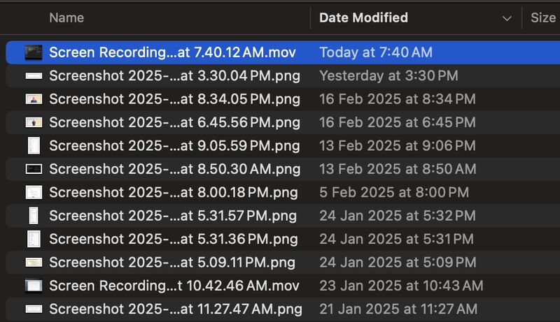
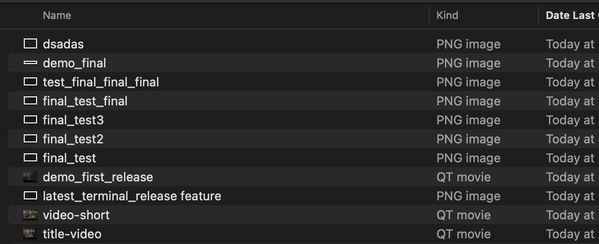

# Auto Snap Title Capture

Auto Title Capture is a cross-platform application designed to capture and manage window titles efficiently. This project is built using Python 3 and is intended for users who need to monitor and log window titles for various applications.

## Features

- Detects active window titles in real-time.
- Cross-platform compatibility (Windows, macOS, Linux).
- Simple and intuitive user interface.

## Installation

To install the required dependencies, run:
`pip3 install -r requirements.txt`

## Usage

To run the application directly, execute:
`python3 src/auto_title_capture.py`

## Building the Application

This project now supports creating a standalone application bundle for both macOS and Windows using PyInstaller.

1. Install the build dependency (if not already installed):
`pip3 install -r requirements.txt`

2. Build the application by running:
`pyinstaller --onefile --windowed src/auto_title_capture.py`

The built application bundle will appear in the `dist` folder.

## Contributing

Contributions are welcome! Please feel free to submit a pull request or open an issue for suggestions or improvements.

## Screenshots

  

    
As Is

    
  

  

    
To Be

    
  

## Acknowledgments

This project was inspired by a post on LinkedIn:
[Is there a program that will automatically capture window titles?](https://www.linkedin.com/posts/dangericke_is-there-a-program-that-will-automatically-activity-7297400112937414659-2pwo?utm_source=share&utm_medium=member_desktop&rcm=ACoAACSsjHQBIzh_KO1xQP5DJ08ul0x7C_cYedQ)

## License

This project is licensed under the MIT License. See the LICENSE file for more details.